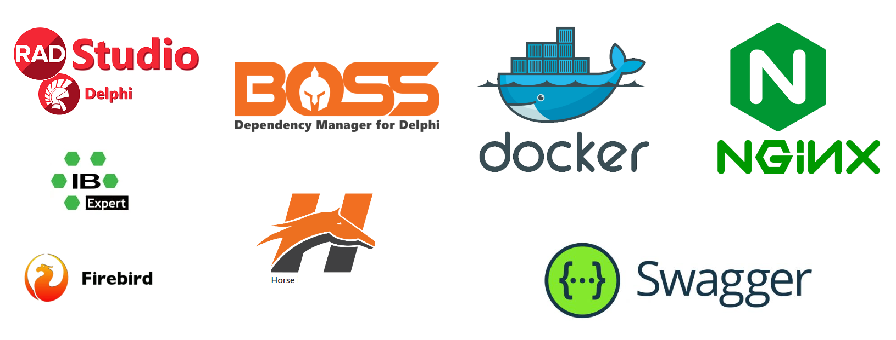
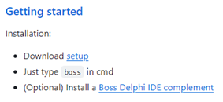
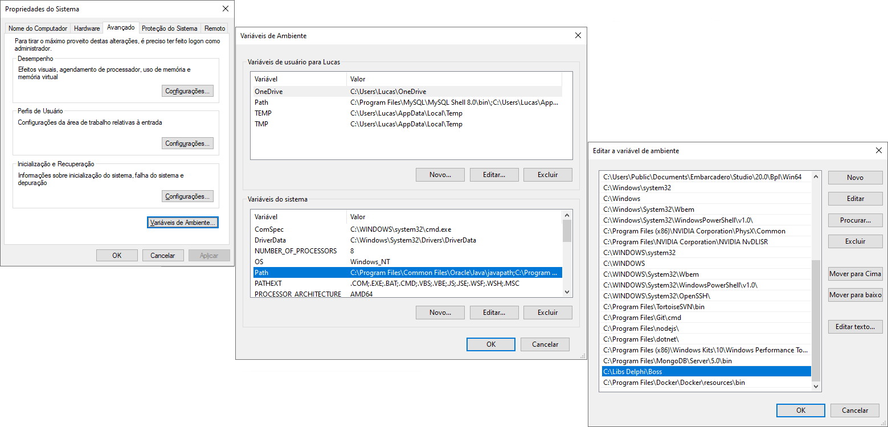
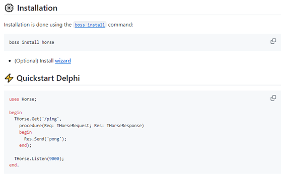
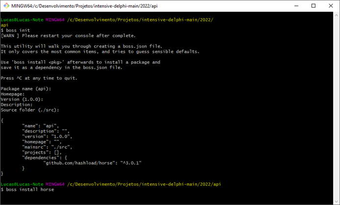
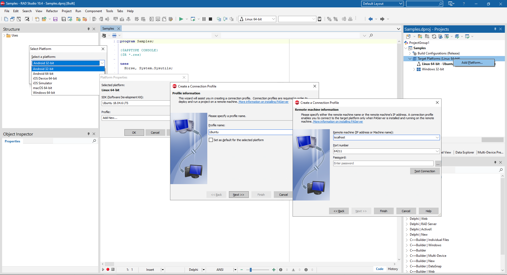
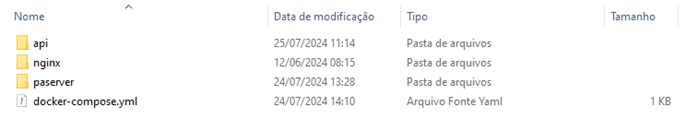

# Avance - Micro4Delphi 


## Installation and configuration
 * Install **Firebird 2.5** located in the project's **Data** folder.
 * Have the following DLLs **midas.dll**, **libeay32.dll**, and **ssleay32.dll** in the project folder next to the executable.
 * Configure the database path in the **Path.sys** file in the project folder next to the executable.
 * To extract the executable, unzip the **Avance.rar** file in the project's **Release** folder.


```	
...Avance\Sources\Win32\Release
``` 

### Tools Used
 

### Installing Boss
[**https://github.com/HashLoad/boss**](https://github.com/HashLoad/boss) 

 




### Installing Horse
[**https://github.com/HashLoad/horse**](https://github.com/HashLoad/horse) 

 


 * Open the console in the project folder to execute Boss commands.
 * First, run “boss init” and confirm the information.
 * Then, run “boss install horse” to install the horse.

 


### Compiling the Delphi application for Linux
 * Right-click on “Add Platform”.
 * Select “Linux 64-bit”.
 * In Profile click on “Add New”.
 * Set a Profile name “Ubuntu”.
 * In Remote enter “localhost”.
 * Click on “Test Connection”.




### Installing Docker
[**https://www.docker.com/products/docker-desktop/**](https://www.docker.com/products/docker-desktop/)


### Configuring Linux machine in Docker
In the Project folder, we have the following structure:
```	
...Avance\Micro4Delphi\MsUser
``` 




 * Access the “paserver” folder, where we have the “Dockerfile” file and the “LinuxPAServer21.0.tar.gz” file according to the Delphi version.
 * Copy to “C:\Program Files (x86)\Embarcadero\Studio\21.0\PAServer”.

[**https://docwiki.embarcadero.com/RADStudio/Sydney/en/Linux_Application_Development**](https://docwiki.embarcadero.com/RADStudio/Sydney/en/Linux_Application_Development) 


**Open a console and run:**
 * First “docker build -t micro4delphi/paserver .” to create an image of the application in Docker.
 * Then “docker run -p 64211:64211 -d micro4delphi/paserver” to run the application in Docker.


### Uploading Delphi applications to Docker as an API
 * Access the “API” folder of each Microservice in the “Micro4Delphi” folder.
 * Open a console and execute the commands from the "Dockerfile - Commands.txt" file.


### Configuring load balancing
 * Access the “nginx” folder of each Microservice in the “Micro4Delphi” folder.
 * Open a console and execute the commands from the "Dockerfile - Commands.txt" file.


### Configuring docker-compose
 * Access the root folder of each microservice in the "Micro4Delphi" folder.
```	
...Avance\Micro4Delphi\MsUser
``` 
 * Open a console and execute the commands in the file "docker-compose.yml - Commands.txt"


## Project Configuration

Unzip the “Avance.rar” file in “C:\Avance”.

The database path is configured in the “Path.sys” file.

When starting the system, the login screen below will appear.


**It is possible to access the system with 2 profiles:**
**Manager Profile**
 * User: LUCASFF
 * Password: 10
 * The “Manager” profile can register schools, users, groups, classes, and issue access and academic performance reports.

**Student Profile**
 * User: ALUNO
 * Password: 10
 * The “Student” profile can attend classes and perform exercises.


## General information
The **Sources** folder contains the project's **.pas** and **.dfm** files. These files are in portuguese and cannot be changed.

The tutorial for creating each microservice can be seen in the document "MsUsers.pdf"
```	
...Avance\Micro4Delphi\MsUser\Tutorial\MsUsers.pdf
``` 
