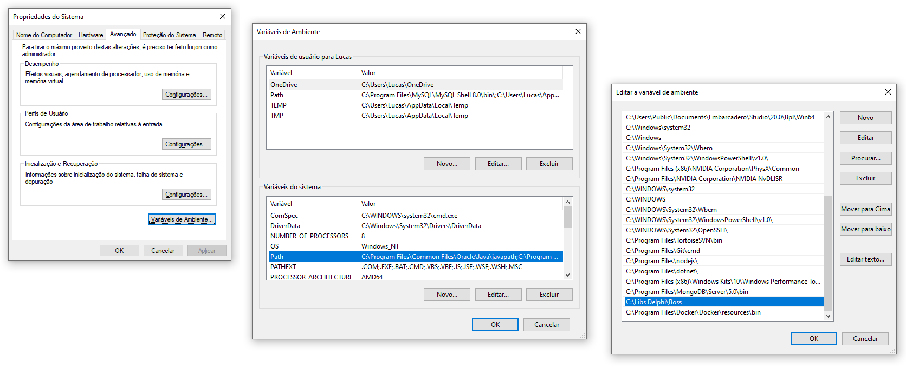
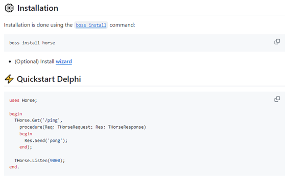
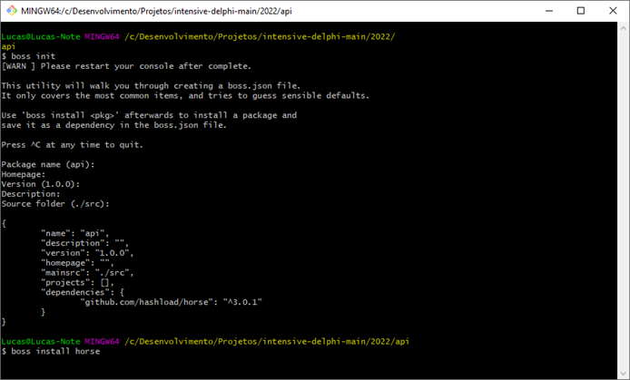
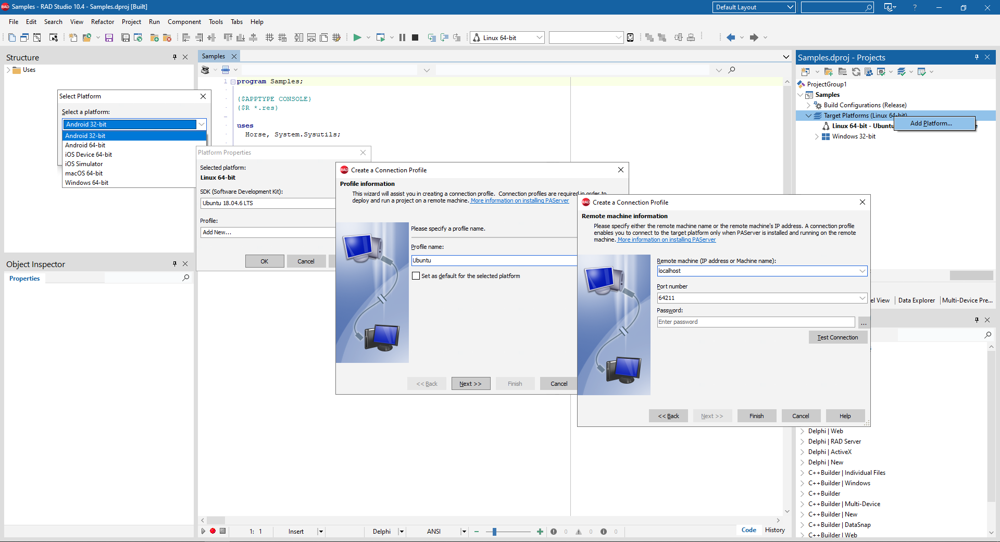
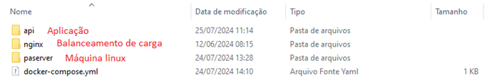

# Avance - Micro4Delphi 


## Instalação e configuração
 * Instalar o **Firebird 2.5** localizado na pasta **Dados** do projeto.
 * Possuir as dlls **midas.dll**, **libeay32.dll** e **ssleay32.dll** na pasta do projeto junto ao executável.
 * Configurar o caminho do banco de dados no arquivo **Caminho.sys** na pasta do projeto junto ao executável.
 * Para extrair o executável basta descompactar o arquivo **Avance.rar** localizado na pasta **Release** do projeto.

```	
...Avance\Fontes\Win32\Release
``` 

### Ferramentas Utilizadas
 

### Instalando o Boss
[**https://github.com/HashLoad/boss**](https://github.com/HashLoad/boss) 

 




### Instalando o Horse
[**https://github.com/HashLoad/horse**](https://github.com/HashLoad/horse) 

 


 * Abrir o console na pasta do projeto para executar os comandos do Boss.
 * Primeiro executar “boss init” e confirmar as informações.
 * Depois executar “boss install horse” para realizar a instalação do horse.

 


### Compilando a aplicação Delphi para Linux
 * Clicar com o botão direito do mouse em “Add Platform”.
 * Selecionar “Linux 64-bit”.
 * Em Profile clicar em “Add New”.
 * Definir um Profile name “Ubuntu”.
 * Em Remote informar “localhost”.
 * Clicar em “Test Connection”.




### Instalando o Docker
[**https://www.docker.com/products/docker-desktop/**](https://www.docker.com/products/docker-desktop/)


### Configurando a máquina Linux no Docker
Na pasta do Projeto, temos a seguinte estrutura.
```	
...Avance\Micro4Delphi\MsUser
``` 




 * Acessar a pasta “paserver”, onde temos o arquivo “Dockerfile” e o arquivo “LinuxPAServer21.0.tar.gz” de acordo com a versão do Delphi.
 * Copiar em “C:\Program Files (x86)\Embarcadero\Studio\21.0\PAServer”.

[**https://docwiki.embarcadero.com/RADStudio/Sydney/en/Linux_Application_Development**](https://docwiki.embarcadero.com/RADStudio/Sydney/en/Linux_Application_Development) 


**Abrir um console e executar:**
 * Primeiro “docker build -t micro4delphi/paserver .” para criar uma imagem da aplicação no Docker.
 * Depois “docker run -p 64211:64211 -d micro4delphi/paserver” para executar a aplicação no Docker.


### Subindo as aplicações Delphi no Docker como API
 * Acessar a pasta “API” de cada Microserviço da pasta "Micro4Delphi".
 * Abrir um console e executar os comandos do arquivo "Dockerfile - Comandos.txt"


### Configurando o balanceamento de carga
 * Acessar a pasta “nginx” de cada Microserviço da pasta "Micro4Delphi".
 * Abrir um console e executar os comandos do arquivo "Dockerfile - Comandos.txt"


### Configurando o docker-compose
 * Acessar a pasta raiz de cada microserviço da pasta "Micro4Delphi".
```	
...Avance\Micro4Delphi\MsUser
``` 
 * Abrir um console e executar os comandos do arquivo "docker-compose.yml - Comandos.txt"


### Configuração do Projeto

Descompactar o arquivo “Avance.rar” em “C:\Avance”.

O caminho do banco de dados está configurado no arquivo “Caminho.sys”.

Ao iniciar o sistema vai aparecer a tela de login abaixo.


**É possível acessar o sistema com 2 perfis:**

**Perfil Gestor**

*Usuário: LUCASFF

*Senha: 10

*O perfil “Gestor” pode cadastrar escolas, usuários, turmas, aulas e emitir relatórios de acessos e de desempenho acadêmico.


**Perfil Aluno**

*Usuário: ALUNO

*Senha: 10

*O perfil “Aluno” pode assistir as aulas e realizar os exercícios.


## Informações gerais

O tutorial para criação de cada microserviço pode ser visto no documento "MsUsers.pdf"
```	
...Avance\Micro4Delphi\MsUser\Tutorial\MsUsers.pdf
``` 
